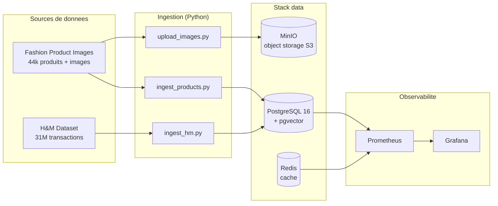

# Architecture Miroir — Bloc 2

## Vue d'ensemble

## Couches

- **Sources** : donnees reelles (Fashion, H&M) + donnees synthetiques generees (Bloc 3).
- **Ingestion** : scripts Python idempotents. `COPY` en streaming pour les gros volumes
  (31M transactions sans saturer la RAM), staging + `INSERT SELECT` pour la selection de colonnes.
- **Stack data** : PostgreSQL (OLTP + vector store via pgvector), MinIO (images/artefacts),
  Redis (cache). Schemas logiques : `core`, `catalog`, `signals`, `reco`, `events`.
- **Observabilite** : exporters Postgres/Redis scrapes par Prometheus, visualises dans Grafana.

## Local vs Cloud

- **Local** : Docker Compose (dev) + Kubernetes via Docker Desktop (orchestration, Helm chart).
- **Cloud (GCP-ready)** : modules Terraform `terraform/gcp/` (VPC, GKE, Cloud SQL Postgres 16,
  buckets GCS), valides via `terraform validate`, prets a `apply`. Mapping direct :
  MinIO vers GCS, Postgres conteneur vers Cloud SQL, K8s local vers GKE.
