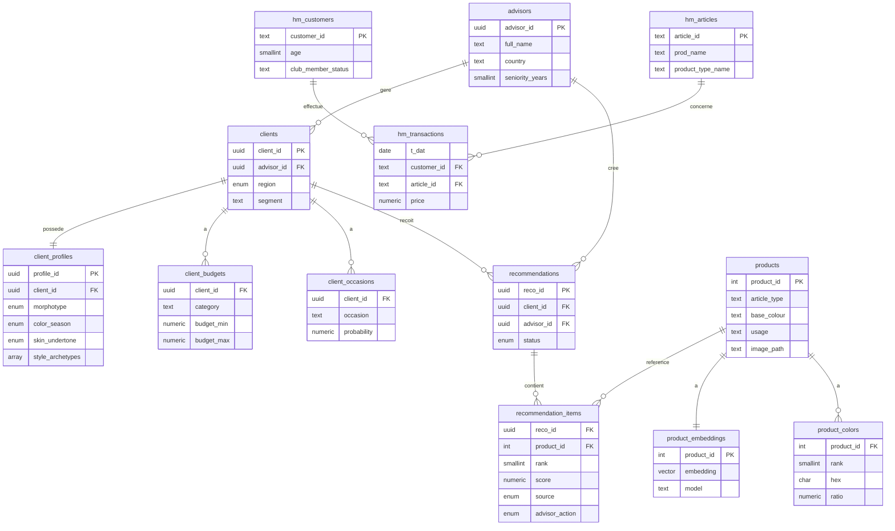

# Modèle de données Miroir — Bloc 2

5 schemas logiques : `core` (metier), `catalog` (produits + vecteurs),
`signals` (H&M brut), `reco` (recommandations), `events` (interactions).

## Choix de modélisation

- **UUID** pour les entites metier (`core`, `reco`) : pattern SaaS, pas de fuite de cardinalite.
- **Types ENUM** (morphotype, saison colorimetrique, sous-ton, statut reco) : integrite forte.
- **pgvector `vector(512)`** : embeddings CLIP ViT-B/32 stockes au cote du catalogue.
- **`signals`** = landing zone brute H&M (fidele aux CSV), transformee au Bloc 3 (dbt).
- **Human-in-the-loop** trace via `recommendation_items.advisor_action` (kept/removed/added).
